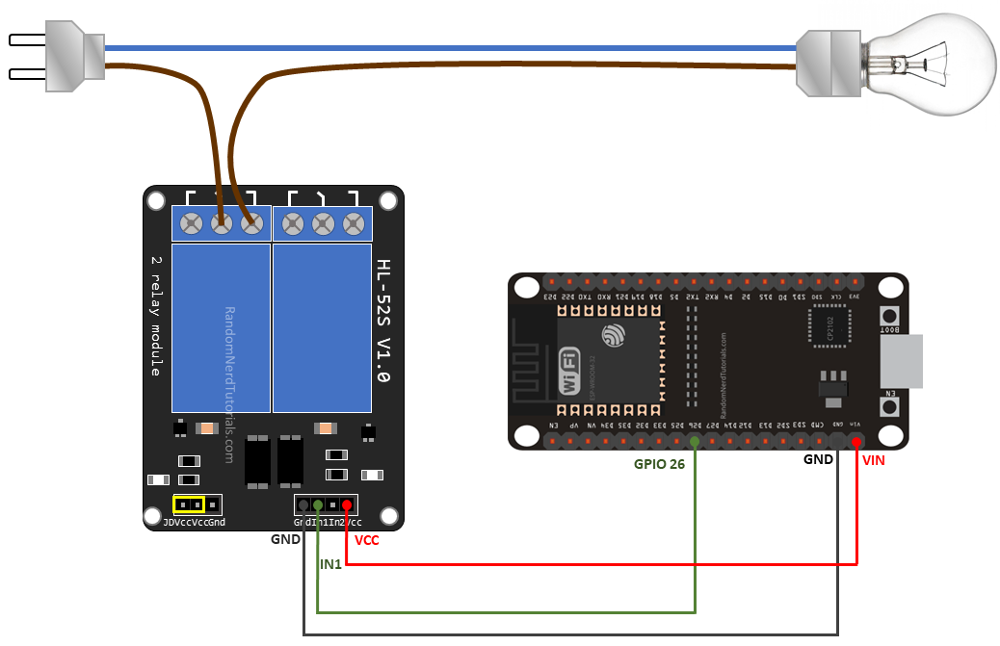

# Wake on Wireless Lan
In this project we intend to remotely control any electric device using an ESP32 and Wake-on-LAN (WOL) Packet.

## Description
Wake-on-LAN (WoL or WOL) is an Ethernet or Token Ring computer networking
standard that allows a computer to be turned on or awakened by a network
message.

The message is usually sent to the target computer by a program executed on
device connected to the same local area network.

The packet sent for Wake on Lan is called Magic Packet, which has the following specifications:
## Magic Packet
The magic packet is a frame that is most often sent as a broadcast and that
contains anywhere within its payload 6 bytes of all 255 (FF FF FF FF FF FF in
hexadecimal), followed by sixteen repetitions of the target computer's 48-bit
MAC address, for a total of 102 bytes.

Since the magic packet is only scanned for the string above, and not actually
parsed by a full protocol stack, it could be sent as payload of any network- and
transport-layer protocol, although it is typically sent as a UDP datagram to port
0 (reserved port number),7 (Echo Protocol) or 9 (Discard Protocol), or directly
over Ethernet. A connection-oriented transport-layer protocol like TCP is less
suited for this task as it requires establishing an active connection before
sending user data.
## Materials
1-ESP32 Development Board

2-5V Relay Module(with optocoupler)

3-F2F Jumper Wires

4-Power Supply for ESP32
## Circuit Diagram

## Usage
1-Upload the Sniffer code on your ESP32 using Arduino IDE

2-Send a magic packet to your ESP32 Ip or mac address using desktop app

